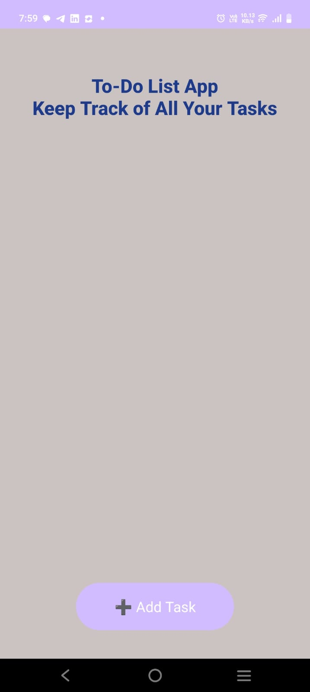

# 📝 To-Do List App (Android - Java)

A simple and intuitive Android To-Do List application built using Java, focusing on core programming concepts such as functions and data structures.

## 📱 Project Overview

This project demonstrates how to create a basic task management app using **Java** and **XML** in Android Studio. Users can add, view, and delete tasks, with each task displayed in a stylish CardView including the date it was added.

## 🚀 Features

- Add new tasks through a dialog box
- Display tasks in CardView format
- Auto-append the current date to each task
- Delete tasks with a single tap
- Responsive and modern UI using RelativeLayout, ScrollView, and LinearLayout

## 🧱 Technologies Used

- Java (Android SDK)
- XML Layouts
- Android CardView & AlertDialog
- Date & Time API (`SimpleDateFormat`)
- Android Studio IDE

## 🖼️ Screenshots

